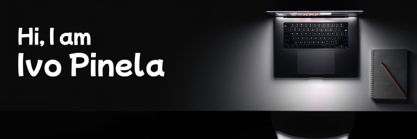

  

  <h1 style="color: white; font-family: 'Arial', sans-serif; margin-top: 20px;">💫 About Me</h1>
  

    I am a recent Computer Engineering graduate, currently working as an Embedded Systems Engineer. 
    I am honored to serve as a guest lecturer at Cetesp at polytech institute Guarda, teaching a course on Data Analysis for the Database II class.  
    I have a strong interest in microcontrollers, learning new programming languages, and exploring databases.  
    Im excited to take on new challenges that allow me to apply my technical skills, continuously learn, and contribute to innovative solutions in the tech world.
  

  ## 🌐 Socials
   
   

  ## 💻 Tech Stack
  

    
    
    
    
    
    
  

  ## 📊 GitHub Stats
  

    <table>
      <tr>
        <td>
          
        </td>
        <td>
          
        </td>
      </tr>
      <tr>
        <td colspan="2" align="center">
          
        </td>
      </tr>
    </table>
  

  ## ✍️ Inspiring Quote
  

    
<strong>“Imagination is more important than knowledge. Knowledge is limited. Imagination encircles the world.”</strong>

    
<em>– Albert Einstein</em>

  

  ## 🔝 Top Contributed Repo
  

   

  ### ⚡ Fun Fact
  
I love experimenting with new technologies and learning how they work behind the scenes.

